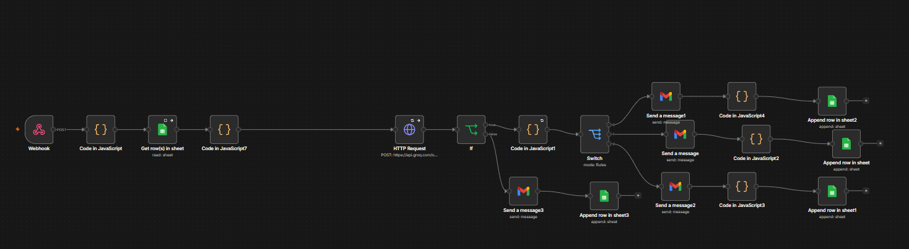
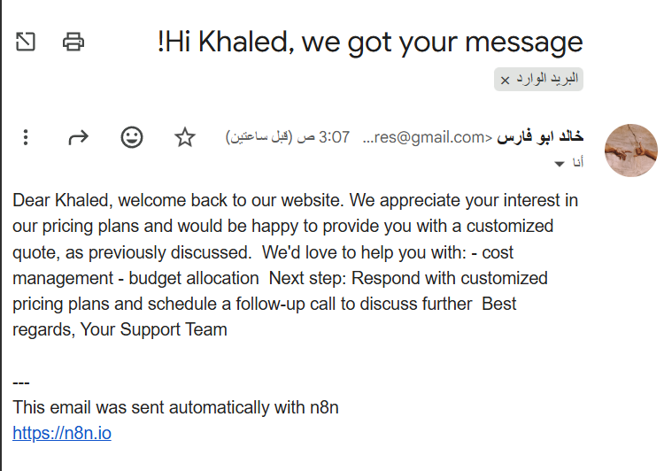
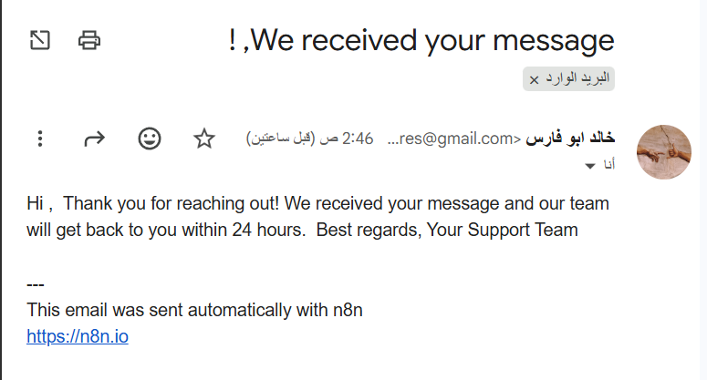

#  AI Lead Generation & Qualification System — n8n Automation

> Fully automated lead qualification pipeline with AI memory, smart routing, and personalized outreach — built on n8n.

[](https://n8n.io)
[](https://groq.com)
[](LICENSE)

---

##  Business Problem

Most businesses lose leads because they respond too slow, too generic, or not at all:

- 📊 **78% of customers buy from the first company that responds** (Harvard Business Review)
- ⏱️ **Average lead response time: 47 hours** — this system responds in **under 10 seconds**
- 🎯 **Only 27% of leads ever get contacted** — this system contacts 100%, automatically
- 💸 Sales teams waste **60% of their time** on unqualified leads
- 📉 Companies lose **$1 trillion/year** due to poor lead follow-up (Salesforce, 2025)
- 🔁 Manual lead scoring is inconsistent — AI scoring is **objective and instant**
- 📈 Personalized outreach increases response rates by **202%** vs generic templates

**The result:** Hot leads go cold, budgets are wasted on the wrong prospects, and revenue is left on the table.

---

##  Solution

A fully automated lead qualification pipeline that:

- Receives leads via Webhook from any source (website, form, LinkedIn, etc.)
- Validates and enriches incoming data instantly
- Checks customer history — remembers returning leads across sessions
- Uses Groq LLM (Llama 3.3 70B) to score, qualify, and personalize outreach
- Routes leads into HOT / WARM / COLD paths with different follow-up strategies
- Sends AI-written personalized emails via Gmail
- Logs every lead to Google Sheets CRM automatically
- Falls back gracefully if AI is unavailable — no lead is ever lost

---

##  Workflow

```
Lead (HTTP POST)
        ↓
    Webhook (Header Auth)
        ↓
  Validate & Enrich (Code Node)
        ↓
  Lookup History (Google Sheets)
        ↓
  Build Context — new vs returning (Code Node)
        ↓
  Groq AI — LLaMA 3.3 70B
        ↓
  Parse & Merge (Code Node)
        ↓
    Switch Router
        ├── HOT  (80–100) → Gmail + Sheets
        ├── WARM (50–79)  → Gmail + Sheets
        └── COLD (0–49)   → Gmail + Sheets

  If Groq fails:
        ↓
  Fallback Email + Sheets (PENDING REVIEW)

  Error Handler → Error Log Sheet
```

---

##  Screenshots

### Workflow Overview

### AI Email — Returning Customer (Memory System in Action)


### AI Email — Fallback (When AI is Unavailable)


### Security Test — Request Rejected Without Token


---

##  How It Works

1. Lead submits their info via HTTP POST to the secured Webhook
2. System validates required fields and generates a unique Lead ID
3. Google Sheets is queried to check if this email has contacted us before
4. Code node builds full context — lead data + last 3 interactions if returning
5. Groq AI receives the full context and returns a structured JSON with score, tier, pain points, and a personalized email intro
6. Switch node routes to HOT / WARM / COLD path
7. Personalized email is sent via Gmail
8. Lead is logged to Google Sheets CRM with all metadata
9. If Groq fails — fallback email is sent and lead is flagged for manual review

---

##  Memory System

The most powerful feature of this system:

| Visit | Customer Status | AI Behavior |
|-------|----------------|-------------|
| 1st | New customer | Standard qualification |
| 2nd+ | Returning customer | References history, increases score, more personal tone |

**Real example from this system:**
- Visit 1 → Score: 60, Response: "Thank you for reaching out..."
- Visit 2 → Score: 70, Response: "Welcome back... as previously discussed..."

---

##  Tech Stack

| Tool | Purpose |
|------|---------|
| n8n | Workflow automation engine |
| Groq — LLaMA 3.3 70B | AI scoring, qualification & personalization |
| Google Sheets | CRM, logging & customer memory |
| Gmail OAuth2 | Personalized email delivery |
| Webhook + Header Auth | Secured entry point |
| JavaScript (Code Node) | Validation, context building, JSON parsing |

---

##  Business Value

| Feature | Impact |
|---------|--------|
| ⏱️ Response time | 47 hours → Under 10 seconds |
| 🧠 AI Memory | Recognizes and adapts to returning leads |
| 🎯 Smart Routing | 3 paths based on AI score |
| 🔒 Webhook Security | Header Auth token required |
| 🔁 Retry Logic | 3 automatic retries on Groq failure |
| 🚨 Fallback System | No lead lost even if AI is down |
| 📋 Auto CRM Logging | Every lead tracked with full metadata |
| 🚨 Error Handling | Separate error log sheet |

---

##  Known Limitations

> Transparency is part of professionalism.

- **Duplicate nodes:** Separate Gmail + Sheets nodes per path — can be refactored into shared nodes
- **No deduplication:** Same lead submitting twice within seconds could create duplicate entries
- **JSON parsing risk:** If LLM returns malformed JSON, workflow errors — structured output mode would be more robust
- **Localhost only:** Currently running on local n8n instance — needs cloud deployment for production
- **No Slack alerts:** HOT leads only trigger email — real-time Slack notification would improve speed

---

##  Future Improvements

- [ ] Deploy to cloud (Railway / Render / VPS)
- [ ] Add Slack notification for HOT leads
- [ ] WhatsApp follow-up via Twilio
- [ ] Deduplication logic for same-session submissions
- [ ] Lead analytics dashboard
- [ ] CRM integration (HubSpot / Pipedrive)
- [ ] Fine-tuned scoring model on industry-specific data

---

##  Setup

### 1. Import the workflow
Download `Lead Generation & Qualification.json` and import it into your n8n instance via **Settings → Import**.
Download `Error Logger.json` and import it as a separate workflow.

### 2. Configure credentials
- **Groq API** — get a free key at [console.groq.com](https://console.groq.com)
- **Google Sheets OAuth2** — connect your Google account
- **Gmail OAuth2** — connect your Gmail account
- **Header Auth** — set your webhook secret token

### 3. Create your Google Sheet
Create a sheet named `Leads CRM` with these columns:
```
Lead ID | Name | Email | Company | Score | Tier | Reason | Pain Points | Action | Date
```

Create a second sheet named `Errors Log`:
```
Time | Error Message | Node Failed | Workflow
```

### 4. Activate and test
```powershell
Invoke-RestMethod -Uri "http://your-n8n-url/webhook/YOUR-ID/lead-capture" `
  -Method POST `
  -ContentType "application/json" `
  -Headers @{"x-webhook-secret"="your-secret"} `
  -Body '{
    "name": "Sara Ahmed",
    "email": "sara@techcorp.com",
    "company": "TechCorp",
    "role": "CEO",
    "employees": 150,
    "message": "We need full sales automation, we have budget",
    "source": "LinkedIn"
  }'
```

---

## 👤 Author

Built by **Khaled Fouad 🤙🏽**

[](https://github.com/Khaled-fouad0)

---

## 📄 License

MIT — free to use, modify, and distribute.
